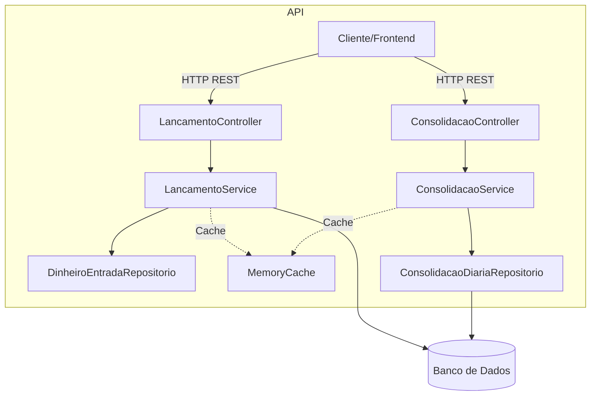
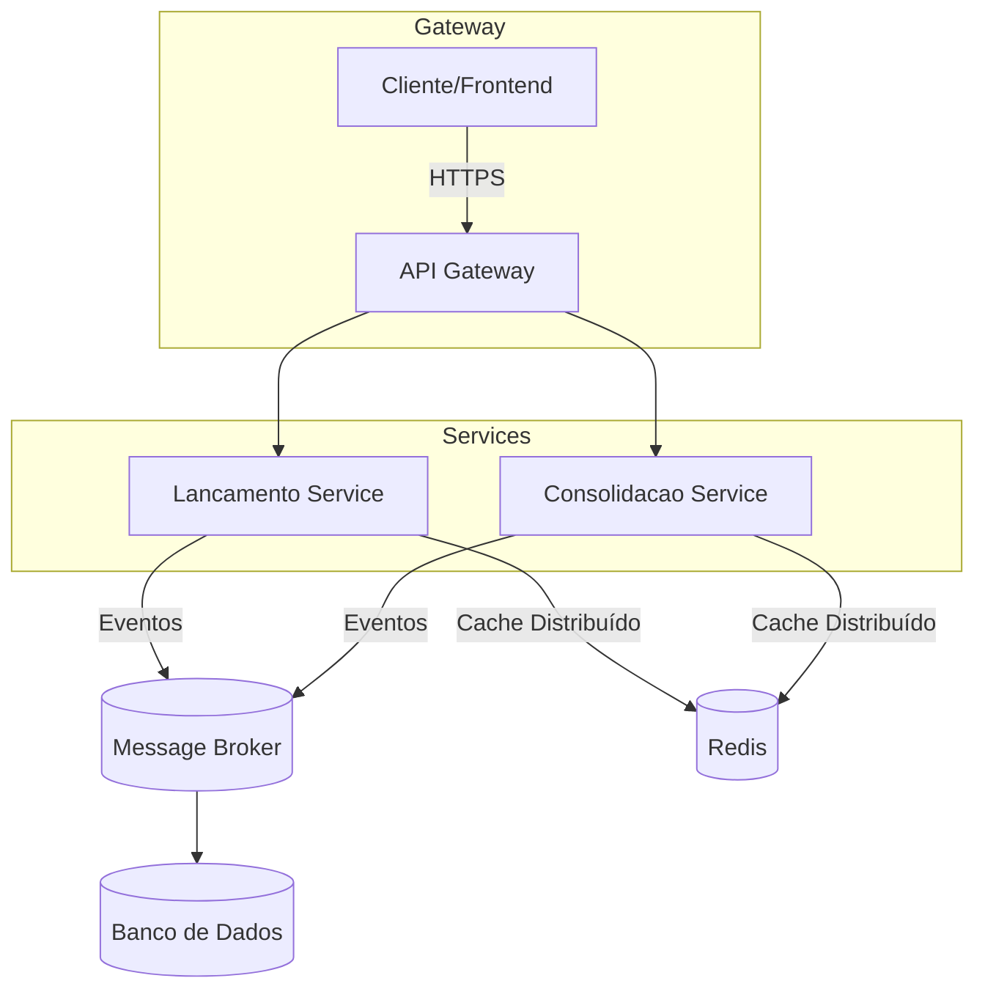

# FluxoCaixa

API em C# para controle de lançamentos financeiros e consolidação diária de saldos, projetada com Clean Architecture para fácil evolução em microsserviços.

## Tecnologias

- .NET 8 e ASP.NET Core Web API
- Entity Framework Core (SQL Server ou InMemory)
- Injeção de Dependência (Microsoft DI)
- Padrões: Repository, Circuit Breaker, Retry Policy, Cache
- Autenticação JWT e configuração de CORS
- Testes unitários: xUnit e Moq
- Diagramas em Mermaid

## Arquitetura Atual



## Evolução para Microsserviços



## Como Rodar Localmente

1. **Pré-requisitos**  
   - .NET 8 SDK  
   - SQL Server local ou remoto (opcional: InMemory)

2. **Configurar string de conexão**  
   Edite `src/FluxoCaixa.Api/appsettings.json`:
   ```json
   "ConnectionStrings": {
     "FluxoCaixaDb": "Server=<SERVIDOR>;Database=FluxoCaixa;User Id=<USUARIO>;Password=<SENHA>;TrustServerCertificate=True;"
   }
   ```

3. **Restaurar e compilar**  
   ```bash
   dotnet restore
   dotnet build
   ```

4. **Executar API**  
   ```bash
   cd src/FluxoCaixa.Api
   dotnet run
   ```

5. **Swagger**  
   Abra no navegador: `https://localhost:5001/swagger`

6. **Executar testes**  
   ```bash
   cd tests
   dotnet test
   ```

## Por que esta abordagem?

- **Monolito modular**: entrega rápida com fronteiras claras (API, Aplicação, Domínio, Infra).  
- **Clean Architecture**: desacoplamento via interfaces, facilita testes e manutenção.  
- **Políticas de resiliência**: Retry Policy e Circuit Breaker garantem disponibilidade.  
- **Cache em memória**: reduz latência e descongestiona o banco.  
- **JWT e CORS**: segurança e flexibilidade para diferentes clientes.  
- **Evolução gradativa**: módulos podem migrar para microsserviços sem refatoração massiva.

## Futuras melhorias

- Cache distribuído (Redis)  
- Mensageria (RabbitMQ/Kafka)  
- Containerização (Docker, Kubernetes)  
- CI/CD (GitHub Actions, Azure DevOps)  
- Monitoramento e métricas (Prometheus, Application Insights)
