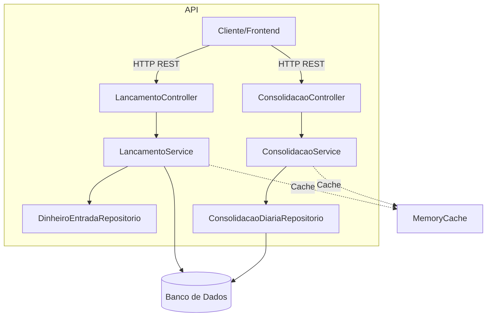
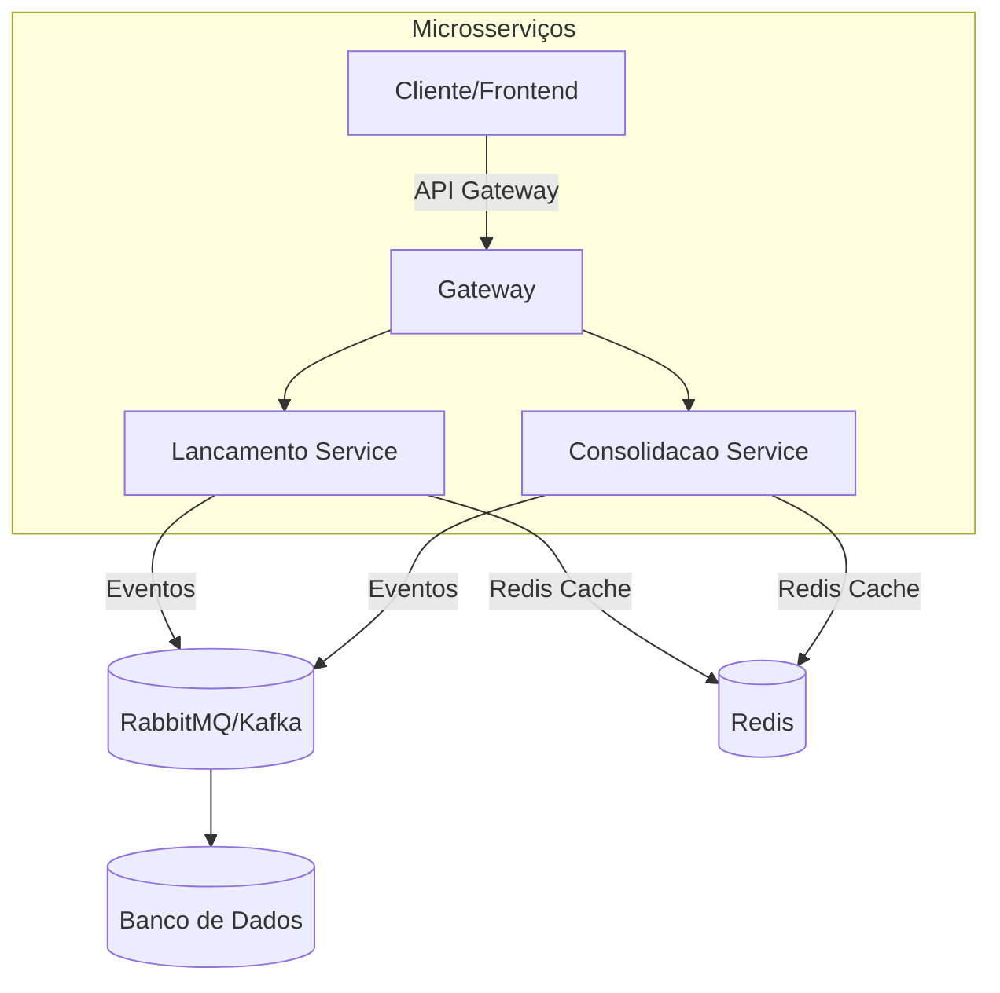

# FluxoCaixa - Controle de Fluxo de Caixa Diário

## Visão Geral
FluxoCaixa é uma API C# para registro de lançamentos financeiros (créditos e débitos) e consolidação diária de saldo. A arquitetura segue um monolito modular com camadas bem definidas (API, Aplicação, Domínio, Infraestrutura), preparada para escalabilidade, resiliência e segurança.

## Pontos Principais
- **Modularidade & SOLID**: separação por camadas e interfaces, facilitando manutenção e testes.
- **Resiliência**: Retry Policy em operações críticas e Circuit Breaker no serviço de consolidação.
- **Escalabilidade**: Instâncias múltiplas do monolito atrás de load balancer; cache em memória para reduzir carga de banco.
- **Isolamento**: falha no serviço de consolidação não interrompe registro de lançamentos.
- **Segurança**: Autenticação JWT, CORS configurável e segredos em `appsettings.json` (recomenda-se variáveis de ambiente).

## Por que escolhi este design
Como desenvolvedor, optei por este monolito modular porque:
- **Modularidade e manutenção:** isola domínios e facilita testes e evolução.
- **Desempenho inicial:** comunicação em memória sem overhead de rede.
- **Resiliência:** retry e circuit breaker garantem disponibilidade contínua.
- **Escalabilidade futura:** módulos podem evoluir em microsserviços conforme a demanda.
- **Simplicidade de deploy:** único artefato e pipeline simplificam o processo de entrega.

## Fluxograma Atual


## Fluxograma de Evolução


## Como Rodar Localmente
1. **Pré-requisitos**:
   - .NET 8 SDK
   - SQL Server local ou remoto
2. **Configurar string de conexão**:
   No `appsettings.json`, adicione:
   ```json
   "ConnectionStrings": {
     "FluxoCaixaDB": "Server=SEU_SERVIDOR;Database=FluxoCaixaDb;User Id=SEU_USUARIO;Password=SUA_SENHA;"
   }
   ```
3. **Restaurar dependências**:
```powershell
dotnet restore
```
4. **Executar a aplicação**:
```powershell
dotnet run --project src/FluxoCaixa.Api/FluxoCaixa.Api.csproj
```
5. **Acessar Swagger**: `https://localhost:7150/swagger`
6. **Banco de Dados**:
   - **InMemory** (padrão):
     ```csharp
     services.AddDbContext<FluxoCaixaContexto>(options =>
         options.UseInMemoryDatabase("FluxoCaixaDb"));
     ```
   - **SQL Server**:
     ```csharp
     services.AddDbContext<FluxoCaixaContexto>(options =>
         options.UseSqlServer(
             builder.Configuration.GetConnectionString("DefaultConnection")));
     ```
   - **Exemplo de connection string** em `appsettings.json`:
     ```json
     "ConnectionStrings": {
       "DefaultConnection": "Data Source=DESKTOP\\PRD,16000;Initial Catalog=Fluxo_Caixa;User ID=sa;Password=1234568;Min Pool Size=5;Max Pool Size=100;Connection Lifetime=600;MultipleActiveResultSets=True;TrustServerCertificate=True"
     }
     ```
7. **Executar testes**:
```powershell
dotnet test
```

## Possíveis Evoluções Futuras
- Cache distribuído (Redis) para suportar múltiplas instâncias.
- Integração de mensageria (RabbitMQ/Kafka) para desacoplamento por eventos.
- Containerização (Docker/Kubernetes) e CI/CD.
- Monitoramento centralizado (Prometheus, Application Insights) e métricas de performance.
