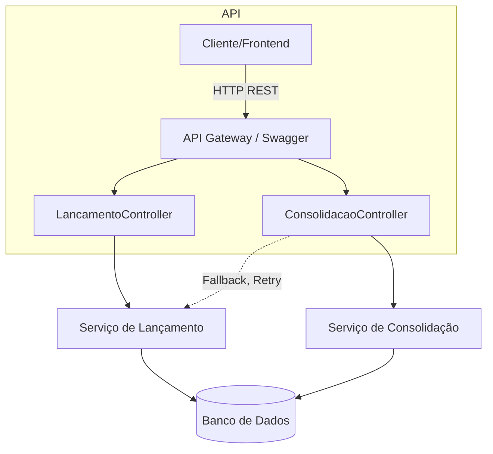

# FluxoCaixa - Controle de Fluxo de Caixa Diário

## Visão Geral
Este projeto implementa um serviço robusto para controle de lançamentos financeiros (débitos e créditos) e consolidação diária de saldo para pequenos comerciantes. A arquitetura foi pensada para ser escalável, resiliente e segura, com base nas melhores práticas do ecossistema .NET.

---

## Decisão Arquitetural: Monolito Modular

**Por que monolito?**
- **Simplicidade:** Um monolito modular reduz a complexidade de deploy, troubleshooting e onboarding de novos desenvolvedores.
- **Performance:** Comunicação entre módulos é feita em memória, sem overhead de rede.
- **Facilidade de Evolução:** A separação clara por módulos (API, Domínio, Aplicação, Infraestrutura) permite evoluir partes do sistema sem grandes impactos.
- **Custo:** Menor custo operacional e de infraestrutura em ambientes pequenos/médios.

**Como evoluir para microsserviços?**
- Os módulos já são bem separados, facilitando extração futura.
- Basta expor endpoints REST ou eventos de mensageria (RabbitMQ, Kafka) e desacoplar os contextos.
- Docker já pode ser usado para isolar e escalar partes do sistema conforme necessidade.

---

## Fluxograma da Solução



- **Observação:** O serviço de lançamento é resiliente. Se o de consolidação falhar, os lançamentos continuam funcionando normalmente (isolamento).

---

## Segurança
- **JWT Authentication**: Todos os endpoints sensíveis protegidos por autenticação JWT.
- **CORS**: Políticas de CORS para ambientes de desenvolvimento e produção.
- **Mensagens customizadas** para erros de autenticação (401).
- **Configuração sensível** (segredo do JWT) via `appsettings.json` (recomenda-se variáveis de ambiente em produção).

---

## Testes Automatizados
- Testes unitários e de integração cobrindo autenticação e regras de negócio críticas.
- Para rodar:
```sh
dotnet test
```

---

## Como rodar localmente
1. **Pré-requisitos:**
   - .NET 8 SDK
   - SQL Server local ou string de conexão válida no `appsettings.json`

2. **Restaurar dependências:**
   ```sh
   dotnet restore
   ```

3. **Rodar a aplicação:**
   ```sh
   dotnet run --project src/FluxoCaixa.Api/FluxoCaixa.Api.csproj
   ```

4. **Acessar o Swagger:**
   - Normalmente em `https://localhost:7150/swagger`

5. **Rodar os testes:**
   ```sh
   dotnet test
   ```

---

## Integração futura com mensageria e Docker
- **Mensageria:**
  - Pode-se integrar RabbitMQ/Kafka para publicar eventos de lançamento/consolidação, permitindo desacoplamento e escalabilidade.
  - Exemplo: Ao registrar um lançamento, publicar evento `LancamentoCriado` para outros serviços.
- **Docker:**
  - O projeto pode ser facilmente dockerizado para facilitar deploy e escalabilidade.
  - Exemplo de `Dockerfile`:
    ```dockerfile
    FROM mcr.microsoft.com/dotnet/aspnet:8.0 AS base
    WORKDIR /app
    EXPOSE 80
    FROM mcr.microsoft.com/dotnet/sdk:8.0 AS build
    WORKDIR /src
    COPY . .
    RUN dotnet restore src/FluxoCaixa.Api/FluxoCaixa.Api.csproj
    RUN dotnet publish src/FluxoCaixa.Api/FluxoCaixa.Api.csproj -c Release -o /app/publish
    FROM base AS final
    WORKDIR /app
    COPY --from=build /app/publish .
    ENTRYPOINT ["dotnet", "FluxoCaixa.Api.dll"]
    ```

---

## Possíveis evoluções
- Extração dos módulos para microsserviços conforme crescimento.
- Implementação de cache distribuído para consultas de consolidação.
- Monitoramento centralizado (Application Insights, Prometheus).
- Integração com filas para garantir resiliência e desacoplamento.
- Suporte a múltiplos usuários e permissões.

---

## Documentação
- Toda a arquitetura, decisões e fluxos estão descritos neste README.
- Diagramas podem ser editados em ferramentas como draw.io ou mermaid live editor.

---

## Contato
Dúvidas ou sugestões? Abra uma issue no repositório ou entre em contato!
